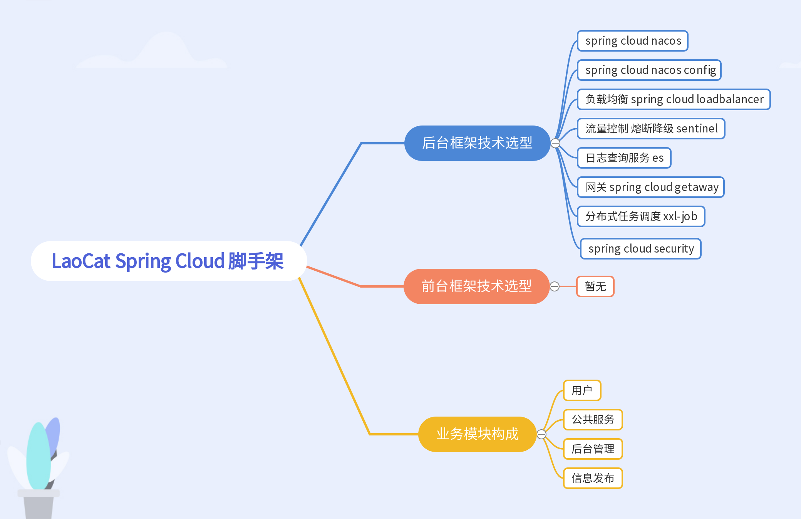

这几天点变动，暂停更新今天，周三恢复更新。

# LaoCat-Spring-Cloud-Scaffold 

LaoCat Spring Cloud 脚手架

# 相关问题提 Issues！！！！ 或关注 浪老猫的Super小窝私聊

### 项目启动需准备

* mysql 8.0
* jdk 1.8
* maven 3.8.1
* nacos 2.0.1
* redis 3.0.504
* jwt

### 项目短期目标

### 项目进度
DB
- 设计权限db   &nbsp;&nbsp;&nbsp;&nbsp;&nbsp;&nbsp;  0%
- 新建权限相关db   &nbsp;&nbsp;&nbsp;&nbsp;&nbsp;&nbsp;  0%

---

后台
- 新建项目引入maven结构   &nbsp;&nbsp;&nbsp;&nbsp;&nbsp;&nbsp;  55%
- 构建项目基本架构   &nbsp;&nbsp;&nbsp;&nbsp;&nbsp;&nbsp;  50%
- 引入网关        &nbsp;&nbsp;&nbsp;&nbsp;&nbsp;&nbsp;  100%
- 引入security   &nbsp;&nbsp;&nbsp;&nbsp;&nbsp;&nbsp;  85%
- 项目模块覆盖security   &nbsp;&nbsp;&nbsp;&nbsp;&nbsp;&nbsp;  100%
- 处理feign上下文传递token、处理非网关访问。   &nbsp;&nbsp;&nbsp;&nbsp;&nbsp;&nbsp;  15%
- 处理swagger ui 在微服务中模块兼容   &nbsp;&nbsp;&nbsp;&nbsp;&nbsp;&nbsp;  1%
- 增加用户模块 权限相关 &nbsp;&nbsp;&nbsp;&nbsp;&nbsp;&nbsp;  0%

----
前台
- 前端模块构建 &nbsp;&nbsp;&nbsp;&nbsp;&nbsp;&nbsp;  0%
- 管理系统页面处理 &nbsp;&nbsp;&nbsp;&nbsp;&nbsp;&nbsp;  0%
- 处理登录授权流程 &nbsp;&nbsp;&nbsp;&nbsp;&nbsp;&nbsp;  0%
- 接入权限系统 &nbsp;&nbsp;&nbsp;&nbsp;&nbsp;&nbsp;  0%

# ❤ 感谢关注 ❤

- ❤ [CSND](https://blog.csdn.net/ProGram_BlackCat) ❤

- ❤ [博客园](https://www.cnblogs.com/LaoCat/) ❤
