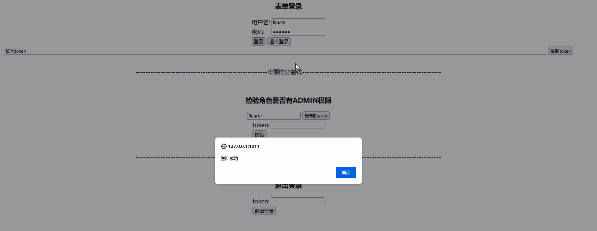

# LaoCat-Scaffold 

LaoCat Spring Cloud 脚手架

# 相关问题提 Issues！！！！ 或关注 浪老猫的Super小窝私聊

### 项目启动需准备

* mysql 8.0
* jdk 1.8
* maven 3.8.1
* nacos 2.0.1
* redis 7.0.2

### 项目技术选型
* spring boot 2.4.2
* spring cloud 2020.0.2
* spring alibaba cloud 2021.1
* hutool 5.5.8
* mybatis 2.1.4
* knife4j 3.0.2
* JWT 0.9.0
* nacos 2.0.1

### 项目短期目标

### 项目进度
DB
- 设计权限db   &nbsp;&nbsp;&nbsp;&nbsp;&nbsp;&nbsp;  70%
- 新建权限相关db   &nbsp;&nbsp;&nbsp;&nbsp;&nbsp;&nbsp;  70%

---

后台
- 新建项目引入maven结构   &nbsp;&nbsp;&nbsp;&nbsp;&nbsp;&nbsp;  55%
- 构建项目基本架构   &nbsp;&nbsp;&nbsp;&nbsp;&nbsp;&nbsp;  50%
- 引入网关        &nbsp;&nbsp;&nbsp;&nbsp;&nbsp;&nbsp;  100%
- 引入security   &nbsp;&nbsp;&nbsp;&nbsp;&nbsp;&nbsp;  95%
- 项目模块覆盖security   &nbsp;&nbsp;&nbsp;&nbsp;&nbsp;&nbsp;  100%
- 处理feign上下文传递token、处理非网关访问。   &nbsp;&nbsp;&nbsp;&nbsp;&nbsp;&nbsp;  15%
- 处理swagger ui 在微服务中模块兼容   &nbsp;&nbsp;&nbsp;&nbsp;&nbsp;&nbsp;  100%
- 增加用户模块 权限相关 &nbsp;&nbsp;&nbsp;&nbsp;&nbsp;&nbsp;  90%
- 全局异常处理、时间序列化处理 &nbsp;&nbsp;&nbsp;&nbsp;&nbsp;&nbsp;  85%

----
前台
- 前端模块构建 &nbsp;&nbsp;&nbsp;&nbsp;&nbsp;&nbsp;  0%
- 管理系统页面处理 &nbsp;&nbsp;&nbsp;&nbsp;&nbsp;&nbsp;  0%
- 处理登录授权流程 &nbsp;&nbsp;&nbsp;&nbsp;&nbsp;&nbsp;  60%
- 接入权限系统 &nbsp;&nbsp;&nbsp;&nbsp;&nbsp;&nbsp;  0%

# ❤ 感谢关注 ❤

- ❤ [CSND](https://blog.csdn.net/ProGram_BlackCat) ❤

- ❤ [博客园](https://www.cnblogs.com/LaoCat/) ❤

---
授权演示

---

## 暂时没有合适的业务场景可开发，故只能维持框子，等待合适的业务场景，在进行相应的开发，泪目....
