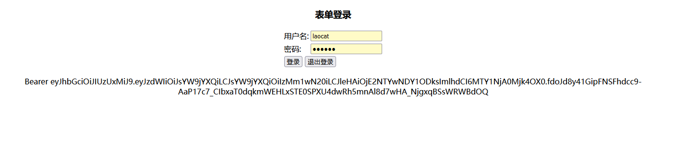

## 如何授权

> 项目采用spring security jwt来实现授权相关功能。 token缓存在redis中。

- 1.启动授权模块
- 2.启动用户模块

- 现阶段并未强制 通过网关访问各服务。


- 3.访问授权登录路径 (前提用户模块已启动、redis已启动、且配置正常)

```shell
# 或者
http://127.0.0.1:2000/laocat_auth/login
```

- 4.输入账号密码后，默认账号密码都为 laocat (前提是你同步了我得sql语句)，请求授权地址如下。

```shell
# 获取
http://127.0.0.1:2000/laocat_auth/authentication
```



token会在下方显示出来，方便复制粘贴到postman测试。

- 5.查看redis


- 复制该token、注意从红框后边复制

- 6.打开postman，填入测试授权链接
  `http://127.0.0.1:1012/author?token=:token`

- 参数填入刚刚的token
  

验证即可。

-7.如果需要对权限进行相关验证，可在postman访问，填入你的token


-----

## 注册接口已完全放开权限可随意请求。