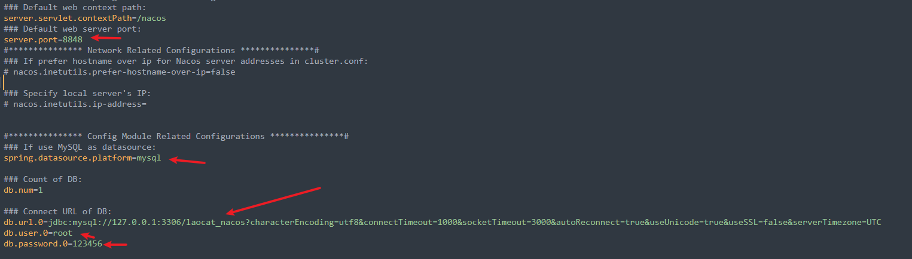

## nacos

### 文件已放到a-software

- 1.解压
- 2.找到conf文件夹
- 3.配置文件修改,箭头指向都需要进行更改和解注释
  
- 4.新建laocat_nacos数据库。
- 5.执行laocat_nacos.sql。
- 6.windows启动、找到bin目录、在bin目录下执行。
  

```shell
.\startup.cmd -m standalone
```