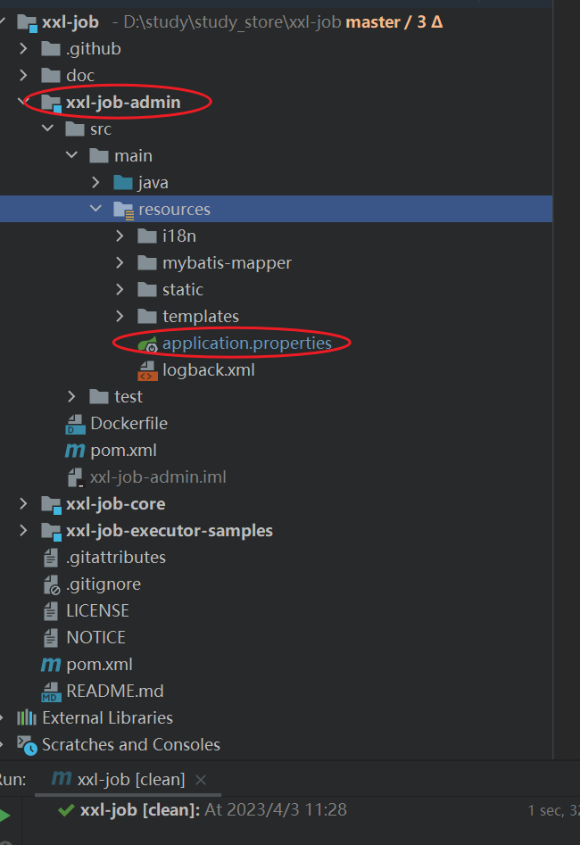
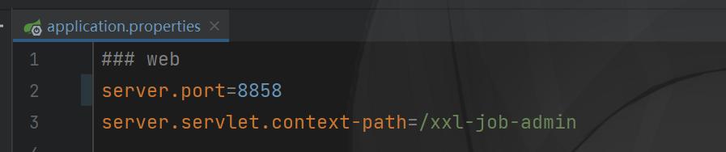
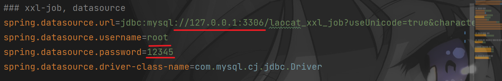
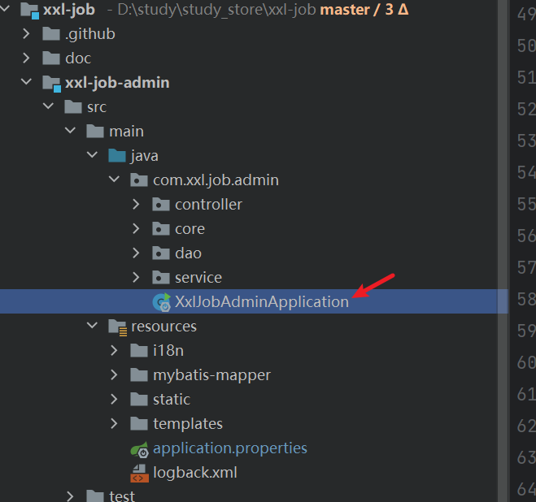
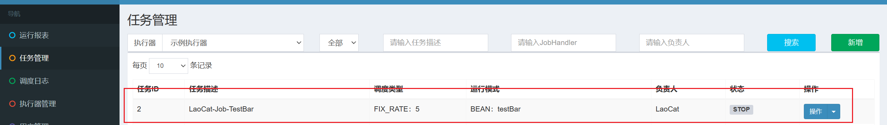
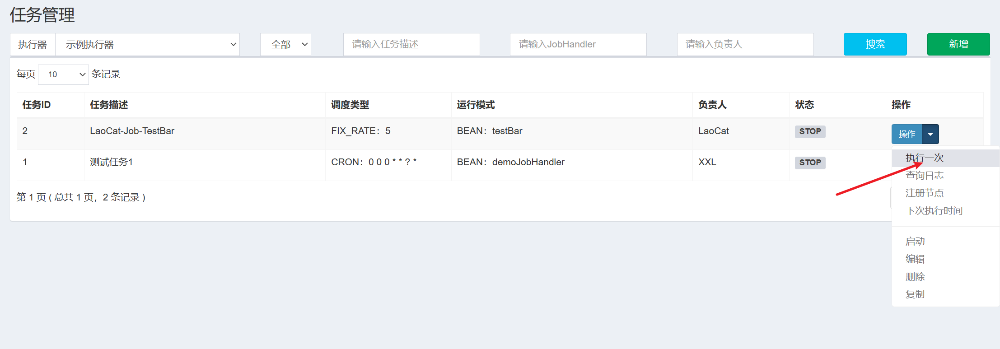
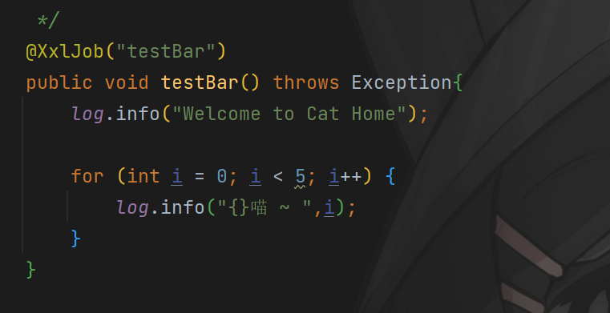
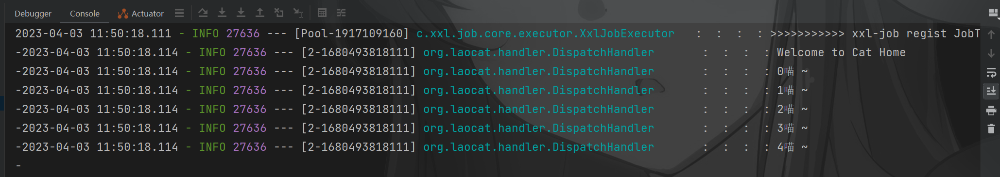

## 本地如何使用xxl-job?

* 通过xxl-job官网访问其gitee或github源码
  `https://www.xuxueli.com/xxl-job/`

* 通过git拉取其源码，导入到idea中。

* 执行db目录下 \
  schena.sql 初始化对应的数据库。 \
  4laocat_xxl_job.sql 初始化对应数据结构与数据

* 修改xxl-job源码
  

修改其端口

修改其数据库为自己的数据库配置

* 然后启动该任务调度中心
  

* 接下来启动项目 `LaoCat-job`

* 访问 http://ip:8858/xxl-job-admin/ (初始账号 admin 123456)
  已经添加了对应的任务
  

* 确保 `LaoCat-job`项目启动成功 然后我们切换到任务调度中心，启动一次该任务
  

* 可以看到调度任务执行成功
  
  